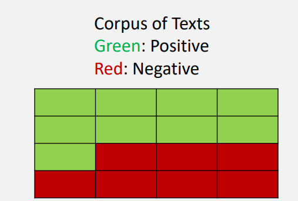
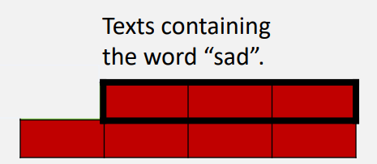

# NLP - TP2

Class: NLP
Created: October 22, 2022 2:54 PM
Created By: Gabriel TRUONG
Reviewed: No
Type: Practical Work
Version: 1.0

# Recap - Practical Work #2

---

Link to my jupyter notebook

[epf_nlp/naiveBayes_model.ipynb at main · GabrielTruong/epf_nlp](https://github.com/GabrielTruong/epf_nlp/blob/main/naiveBayes/naiveBayes_model.ipynb)

---

## Objectives

We will again build a model for sentiment analysis on tweets. This time instead of using [Logistic Regression](https://www.notion.so/NLP-TP1-84516c96b47d4d448e4ccf8b02a76328), we will use **Naive Bayes** to do that.

## Tools

We will implement this program using Python 3.8. Also, we will need several libraries:

- Pandas & Numpy: Manipulate the data
- [Natural Language Toolkit (NLTK):](https://www.nltk.org/) Leading library for building Python programs that work with human language data. Also hosts several datasets including the one we will work on: [twitter_samples_dataset](https://www.nltk.org/howto/twitter.html).

---

## What is Naive Bayes ?

Let’s consider a corpus of text in which we got:

- $N$: the number of words
- $N negative$: the number of words that have a negative sentiment score
- $Npositive$: the number of words that have a positive sentiment score



We also consider that a probability is frequency of occurence. Thus, we get the following probability:

- $P(negative)= \frac{N}{Nnegative} = \frac{7}{16} = 43.75%$%
- $P(positive) = 1 - P(negative) = 56.25%$%

Now, let’s consider that within this corpus of text the word “sad” occurs 4 times and out of these 4 sentences, 3 of them are negative.


We then have: 

$P("sad") = \frac{Nsad}{N}=\frac{4}{16}=0.25$ is the probability of having the word sad in a sentence out of all of the sentences of the corpus.

$P(Negative \cap"sad") = \frac{3}{16}=0.1875 = P(Negative,"sad")$ is the probability of having the word sad in a sentence out of all of the sentences of the corpus and this very sentence is negative.

$P(Negative |"sad") = \frac{3}{4}=0.75$  is the probability of a sentence being negative if it contains the word “sad”.

Let’s consider the case where we only study the negative sentences. 



We have: $P("sad" | Negative)= \frac{3}{7}=0.428$ the probability that the sentence contains the word “sad” knowing that the sentence is negative.

The ********************Bayes Rule******************** states the following of ****A**** knowing that ************************************B already happened************************************: 

$P(A | B) = P(A | B) * \frac{P(A)}{P(B)}$

Hence, we can calculate the probability of A given B if we know the probability of B given A and the ratio of P(A) and P(B).

We will use the Bayes rule to build a sentiment classification model. The model will be indeed supervised. However, the terms *****naïve***** comes from that Naive Bayes pressupposes that the features are independent. On a general basis, that is not the case but it works well. 

Let’s build the model !

---

## 1. Prepare the data

### Data Collection

First, we need to collect the data that we want to work. As we said in the previous section, we need to use NLTK data collection. 

```python
import nltk 
nltk.download('twitter_samples')
ntlk.download('stopwords')

# get the sets of positive and negative tweets
all_positive_tweets = twitter_samples.strings('positive_tweets.json')
all_negative_tweets = twitter_samples.strings('negative_tweets.json')

# split the data into two pieces, one for training and one for testing (validation set)
test_pos = all_positive_tweets[4000:]
train_pos = all_positive_tweets[:4000]
test_neg = all_negative_tweets[4000:]
train_neg = all_negative_tweets[:4000]

train_x = train_pos + train_neg
test_x = test_pos + test_neg

# avoid assumptions about the length of all_positive_tweets
train_y = np.append(np.ones(len(train_pos)), np.zeros(len(train_neg)))
test_y = np.append(np.ones(len(test_pos)), np.zeros(len(test_neg)))
```

A stop word is a commonly used word (such as “the”, “a”, “an”, “in”) that we want to ignore since it won’t be useful to us. 

- The `twitter_samples` contains subsets of 5,000 positive tweets, 5,000 negative tweets, and the full set of 10,000 tweets.
    - If you used all three datasets, we would introduce duplicates of the positive tweets and negative tweets.
    - You will select just the five thousand positive tweets and five thousand negative tweets and split into train and test sets.

### Data Processing

As always when building Machine Learning model, we need to process the data. In our case, we need to do the following steps:

- Remove noise: Remove all the words that are note useful for our model such as ‘I,you,are,etc…’. These words don’t give us information about sentiment.
- Remove extra words and characters that would not benefit our model (hashtags, hyperlinks, symbols…).
- Remove the punctuation so that we can treat words the same way regardless of the punctuation (”happy”, “happy!”,”happy?”).
- Use stemming to only keep track of one variation of each word. In other words, we'll treat "motivation", "motivated", and "motivate" similarly by grouping them within the same stem of "motiv-".

Like in our previous practical work, the `process_tweet()` function helps us do that.

```python
custom_tweet = "RT @Twitter @chapagain Hello There! Have a great day. :) #good #morning http://chapagain.com.np"
print(process_tweet(custom_tweet))
#-> ['hello', 'great', 'day', ':)', 'good', 'morn']
```

### Implementing helper functions

Before training our Naive Bayes model, we need to build a dictionnary that returns a frequency for each (word,label). For the sentence: “I am sad because I heard sad news.” the dictionnary would give us `{(”sad”,0)} : 2`. So for the word “sad” which value is 0 (negative) occured 2 times. Then for each sentence/tweet that contains this word, the dictionnary will be updated. 

 

```python
def count_tweets(result, tweets, ys):
    '''
    Input:
        result: a dictionary that will be used to map each pair to its frequency
        tweets: a list of tweets
        ys: a list corresponding to the sentiment of each tweet (either 0 or 1)
    Output:
        result: a dictionary mapping each pair to its frequency
    '''

    for y, tweet in zip(ys, tweets):
        for word in process_tweet(tweet):
            # define the key, which is the word and label tuple
            pair = (word, y)
            # if the key exists in the dictionary, increment the count
            if pair in result:
                result[pair] += 1
            # else, if the key is new, add it to the dictionary and set the count to 1
            else:
                result[pair] = 1

    return result
```

Let’s that the function gives us what we just described. 

```python
result = {}
tweets = ['i am happy', 'i am tricked', 'i am sad', 'i am tired', 'i am tired']
ys = [1, 0, 0, 0, 0]
count_tweets(result, tweets, ys)
#-> {('happi', 1): 1, ('trick', 0): 1, ('sad', 0): 1, ('tire', 0): 2}
```

---

## 2. Train a Naive Bayes Model

The benefit of the Naive Bayes Model is that it takes a short time to train and has a short prediction time. To build the model we will follow the following steps:

1. **Identify the number of classes $D, Dpos, Dneg$.**
2. ************************************************************************Create a probability for each class given by:************************************************************************
    
    $P(Dpos) = \frac{Dpos}{D}$ & $P(Dneg) = \frac{Dneg}{D}$
    
3. **Compute the Prior and Logprior**

The prior probability represents the underlying probability in the target population that a tweet is positive versus negative. In other words, if we had no specific information and blindly picked a tweet out of the population set, what is the probability that it will be positive versus that it will be negative?

The prior is the ratio of the probabilities $\frac{P(Dpos)}{P(Dneg)}$. We can take the log of the prior to rescale it, and we'll call this the logprior:

  $logprior = log(\frac{P(Dpos)}{P(Dneg)}) = log(\frac{Dpos}{Dneg})$

1. **************************************************************************************************************Compute the positive and neagtive probability of a word**************************************************************************************************************

To compute the positive probability and the negative probability for a specific word in the vocabulary, we'll use the following inputs:

- $freq-pos$ and $freq-neg$ are the frequencies of that specific word in the positive or negative class. In other words, the positive frequency of a word is the number of times the word is counted with the label of 1.
- $Npos$ and $Nneg$ are the total number of positive and negative words for all documents (for all tweets), respectively.
- $V$ is the number of unique words in the entire set of documents, for all classes, whether positive or negative.

We'll use these to compute the positive and negative probability for a specific word using this formula: 

$P(Wpos) = \frac{freq-pos + 1}{Npos +V}$ & $P(Wneg) = \frac{freq-neg + 1}{Nneg +V}$.

We add the “+1” in the numerator if the word is not present in the training for the class, the probability will be zero. We use smoothing to avoid that.

1. **********Log likelihood**********

To compute the loglikelihood of that very same word, we can implement the following equations:

$loglikelihood = log(\frac{P(Wpos)}{P(Wneg)}$

```python
def train_naive_bayes(freqs, train_x, train_y):
    '''
    Input:
        freqs: dictionary from (word, label) to how often the word appears
        train_x: a list of tweets
        train_y: a list of labels correponding to the tweets (0,1)
    Output:
        logprior: the log prior. (equation 3 above)
        loglikelihood: the log likelihood of you Naive bayes equation. (equation 6 above)
    '''
    loglikelihood = {}
    logprior = 0

    # calculate V, the number of unique words in the vocabulary
    vocab = set([pair[0] for pair in freqs.keys()])
    V = len(vocab)

    N_pos = N_neg = 0
    for pair in freqs.keys():
        if pair[1] > 0:
            N_pos += freqs.get(pair,0)            
        else:
          N_neg += freqs.get(pair,0) 
    D = len(train_y) 
    D_pos = sum(train_y) # because positives are 1s in the list of labels...
    D_neg = D - D_pos

    logprior = np.log(D_pos) - np.log(D_neg) 

    for word in vocab:
        freq_pos = lookup(freqs,word,1)
        freq_neg = lookup(freqs,word,0)

        p_w_pos = (freq_pos+1)/(N_pos+V)
        p_w_neg = (freq_neg+1)/(N_neg+V)

        loglikelihood[word] = np.log(p_w_pos/p_w_neg)

    return logprior, loglikelihood
```

## 3. Make prediction with the Naïve Bayes model

Now that we have the `logprior` and `loglikelihood`, we can test the naive bayes function by making predicting on some tweets!

We want to calculate the probability that the tweet belongs to the positive or negative class.

$p = logprior + \sum_{i}^{N}(loglikelihood)$

How do we know if the word is positive or negative ? 

- $p > 0$  then the tweet has a positive sentiment
- $p < 0$  then the tweet has a negative sentiment

```python
def naive_bayes_predict(tweet, logprior, loglikelihood):
    '''
    Input:
        tweet: a string
        logprior: a number
        loglikelihood: a dictionary of words mapping to numbers
    Output:
        p: the sum of all the logliklihoods of each word in the tweet (if found in the dictionary) + logprior (a number)

    '''
    # process the tweet to get a list of words
    word_l = process_tweet(tweet)

    p = 0

    p += logprior

    for word in word_l:
        if word in loglikelihood:
            p += loglikelihood.get(word)

    return p
```

```python
my_tweet= 'She smiled.'
p= naive_bayes_predict(my_tweet, logprior, loglikelihood)
print('The expected output is', p)
#-> 1.57369
```

## 4. ************Test the Naïve Bayes model************

Let’s implement a function that tests the model on the test set and calculates the accuracy.

```python
def test_naive_bayes(test_x, test_y, logprior, loglikelihood):
    """
    Input:
        test_x: A list of tweets
        test_y: the corresponding labels for the list of tweets
        logprior: the logprior
        loglikelihood: a dictionary with the loglikelihoods for each word
    Output:
        accuracy: (# of tweets classified correctly)/(total # of tweets)
    """
    accuracy = 0  # return this properly

    y_hats = []
    for tweet in test_x:
        # if the prediction is > 0
        if naive_bayes_predict(tweet, logprior, loglikelihood) > 0:
            pred = 1
        else:
            pred = 0
        y_hats.append(pred)
    error = sum(y_hats-test_y)/len(y_hats)
    accuracy = 1-accuracy

    return accuracy
```

```python
print("Naive Bayes accuracy = %0.6f" %
      (test_naive_bayes(test_x, test_y, logprior, loglikelihood)))
#-> 0.994
```

## 5. Error Analysis

In this part, we will analyse why the model misclassified some words. We will use the following code to display the tweets that were misclassified by the model.

```python
print('Truth Predicted Tweet')
for x, y in zip(test_x, test_y):
    y_hat = naive_bayes_predict(x, logprior, loglikelihood)
    if y != (np.sign(y_hat) > 0):
        print('%d\t%0.2f\t%s' % (y, np.sign(y_hat) > 0, ' '.join(
            process_tweet(x)).encode('ascii', 'ignore')))
```

Truth Predicted Tweet
1	0.00	b''
1	0.00	b'truli later move know queen bee upward bound movingonup'
1	0.00	b'new report talk burn calori cold work harder warm feel better weather :p'
1	0.00	b'harri niall 94 harri born ik stupid wanna chang :d'
1	0.00	b''
1	0.00	b''
1	0.00	b'park get sunlight'
1	0.00	b'uff itna miss karhi thi ap :p'
0	1.00	b'hello info possibl interest jonatha close join beti :( great'
0	1.00	b'u prob fun david'
0	1.00	b'pat jay'
0	1.00	b'whatev stil l young >:-('

As we can see in the Tweet section, most of them are mispelled and use abbreviation that might have got the model confused.