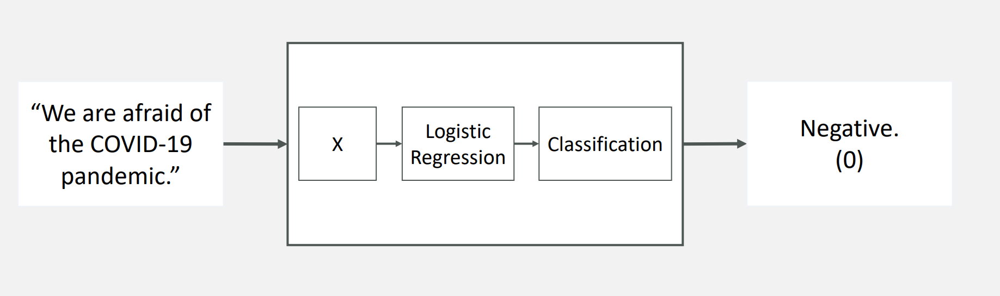
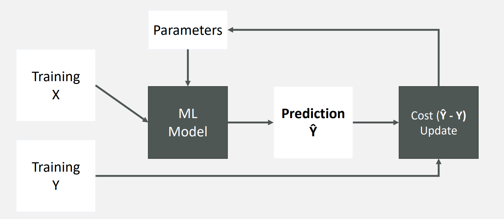
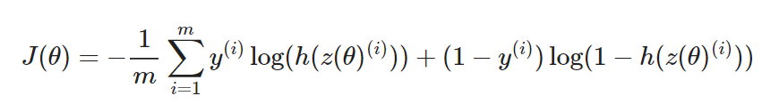

# Twitter Sentiment Analysis using Logistic Regression

---

### Link to my jupyter notebook

[Repository](https://github.com/GabrielTruong/epf_nlp/blob/main/Ex1/Ex_1-blank.ipynb)

---

## Objectives

We want to perform sentiment analysis using Logistic Regression as the following figure shows:


Figure 1 - Logistic Regression for Sentiment Analysis


In order to do that, we will follow the following steps:

1. Extracting Features from text for Logistic Regression
2. Implementing Logistic Regression
3. Use logistic regression and test it for an NLP example
4. Performance of the model

## Tools

We will implement this program using Python 3.8. Also, we will need several libraries:

- Pandas & Numpy: Manipulate the data
- [Natural Language Toolkit (NLTK):](https://www.nltk.org/) Leading library for building Python programs that work with human language data. Also hosts several datasets including the one we will work on: [twitter_samples_dataset](https://www.nltk.org/howto/twitter.html).

---

## 1. Extracting Features

### Data Collection

First, we need to collect the data that we want to work. As we said in the previous section, we need to use NLTK data collection. 

```python
import nltk 
nltk.download('twitter_samples')
ntlk.download('stopwords')

from nltk.corpus import twitter_samples
# select the set of positive and negative tweets
all_positive_tweets = twitter_samples.strings('positive_tweets.json')
all_negative_tweets = twitter_samples.strings('negative_tweets.json')
```

A stop word is a commonly used word (such as “the”, “a”, “an”, “in”) that we want to ignore since it won’t be useful to us. 

- The `twitter_samples` contains subsets of 5,000 positive tweets, 5,000 negative tweets, and the full set of 10,000 tweets.
    - If you used all three datasets, we would introduce duplicates of the positive tweets and negative tweets.
    - You will select just the five thousand positive tweets and five thousand negative tweets.

We will skip the part where we split the data into train and test set to focus more on what the program does.

### Frequency dictionnary

We will need a frequency dictionnary later for extracting the feature. So we create the `build_freqs()`. It basically stores the occurence of a word in the list of tweet.

```python
for y,tweet in zip(ys, tweets):# on each tweet
	for word in process_tweet(tweet):# on each word of the tweet
			pair= (word, y)
			if pair in freqs:# if the pair is already a key...
				freqs[pair]+= 1# increases the count
			else:# if the pair is not yet a key...
				freqs[pair]= 1# adds a new pair to the dict
```

### Process tweet

Then as we said earlier, we want to get rid of the stop words and unecessary caracters such as #,@… So we create a `process_tweet()`  function that will do that using RegEx. 

For example: 

⇒ Original positive tweet: #FollowFriday @France_Inte @PKuchly57 @Milipol_Paris for being top engaged members in my community this week :)

⇒ Processed tweet:  ['followfriday', 'top', 'engag', 'member', 'commun', 'week', ':)']

### Extracting the features

Given a list of tweets, we want to extract the features and store them in a matrix. We will separate the features in two categories:

- The number of positive words in a tweet
- The number of negative words in a tweet

This step is particular helpful since learning algorithm only works with numbers and not words. The `extract_features()` function takes as input a list of words in one tweet and a dictionnary of frequencies and return the tweet processed.

```python
def extract_features(tweet, freqs):
    '''
    Input: 
        tweet: a list of words for one tweet
        freqs: a dictionary corresponding to the frequencies of each tuple (word, label)
    Output: 
        x: a feature vector of dimension (1,3)
    '''
# process_tweet tokenizes, stems, and removes stopwords
    word_l = process_tweet(tweet)
    
    # 3 elements in the form of a 1 x 3 vector
    x = np.zeros((1, 3)) 
    
    #bias term is set to 1
    x[0,0] = 1 
    # loop through each word in the list of words
    for word in word_l:
        
        # increment the word count for the positive label 1
        x[0,1] += freqs.get((word,1),0) 
        
        # increment the word count for the negative label 0
        x[0,2] += freqs.get((word,0),0) 
        
    assert(x.shape == (1, 3))
    return x
```

Let’s try to pass an element of our train data. 

```python
tmp1= extract_features(train_x[0], freqs)
print(tmp1)
#-> [[1.00e+00 3.02e+03 6.10e+01]]
```

We get in return a vector of three elements. The first element (1.00e+00) exists for computing the bias. The `extract_features` returns a vector that has the same dimension of the input data.

---

## 2. Implement Logistic Regression

We need Logistic Regression because it will help us to classify sentiments in texts. The framework to develop a Logistic Regression works as below:




Figure 2 - Logistic Regression flowchart

### Sigmoid Function

First we need to code the sigmoid function:

 $h(z) = \frac{1}{1+exp(-z)}$ .

It returns a probability between 0 and 1. 

```python
def sigmoid(z): 
    '''
    Input:
        z: iscalar or numpy array
    Output:
        h: the sigmoid of z
    '''

    h = 1/(1+np.exp(-z))

    return h
```

The z variable takes the following form: $z = w_0x_0 + w_1x_1+...+w_nx_n$. We call the $\theta_0,\theta_1,...,\theta_n$ the weights of the Logistic Regression and our goal is to find the best parameters that “fits” our data the best. 

### Cost Function

The cost function used for logistic regression is the average of the log loss across all training and follows the equation:



- $m$  is the number of training examples
- $y^i$ is the actual label of the i-th training example.
- $h(z(\theta))^i$ is the model's prediction for the i-th training example.

As the figure 2 details, the cost function will help us to update our parameters through gradient descent.

### Gradient Descent

To update your weight vector $\theta$, you will apply gradient descent to iteratively improve your model's predictions.The gradient of the cost function J with respect to one of the weights $\theta_j$ is:


- 'i' is the index across all 'm' training examples.
- 'j' is the index of the weight θj, so xj is the feature associated with weight θj
- To update the weight $\theta_j$, we adjust it by subtracting a fraction of the gradient determined by $\alpha$:

$$
\theta_j = \theta_j - \alpha * \nabla J(\theta)
$$

- The learning rate $\alpha$  is a value that we choose to control how big a single update will be.

```python
def gradientDescent(x, y, theta, alpha, num_iters):
    '''
    Input:
        x: matrix of features which is (m,n+1)
        y: corresponding labels of the input matrix x, dimensions (m,1)
        theta: weight vector of dimension (n+1,1)
        alpha: learning rate
        num_iters: number of iterations for which you want to train your model
    Output:
        J: the final cost
        theta: your final weight vector
    Hint: you might want to print the cost to make sure that it is going down.
    '''
# get 'm', the number of rows in matrix 
xm, _= x.shape

for i in range(num_iters):

# get z, the dot product of x and theta
z= np.dot(x,theta)

# get the sigmoid of z
h= sigmoid(z)

# calculate the cost function
J=-(1/m)*(np.dot(y.T,np.log(h))+np.dot((1-y).T,np.log(1-h))) 
# update the weights theta
theta= theta- (alpha/m)*np.dot(x.T,(h-y))

    J= float(J)
return J, theta
```

The `gradientDescent`function takes as input: $x, y, \theta, \alpha, N$ with N being the number of iterations and returns the cost and the weights after training. Let’s try to train our model with our data ie. X,Y. 

```python
J, theta= gradientDescent(X, Y, np.zeros((3, 1)), 1e-9, 1500)
print(f'Cost after training : {J:.8f}.')
print(f'Vector of weights : {[round(t, 8)for tin np.squeeze(theta)]}')
#-> Cost after training : 0.24215474.
#-> Vector of weights : [7e-08, 0.00052391, -0.00055517]
```

The vector of weights will be use in the final sigmoid function to predict the probability of a tweet being negative or positive. More later.

---

## 3. Test the Logistic Regression model and predict !

After we trained the Logistic Regression model, we want to test on new inputs to predict wheter the tweet is positive or negative. We implemented the `predict_tweet` function. What this function does is simple: 

- Given a tweet, process it, then extract the features.
- Apply the model's learned weights on the features to get the logits.
- Apply the sigmoid to the logits to get the prediction (a value between 0 and 1).

```python
def predict_tweet(tweet, freqs, theta):
    '''
    Input:
        tweet: a string
        freqs: a dictionary corresponding to the frequencies of each tuple (word, label)
        theta: (3,1) vector of weights
    Output:
        y_pred: the probability of a tweet being positive or negative
    '''

# extract the features of the tweet and store it into x
x= extract_features(tweet,freqs)

# make the prediction using x and theta
y_pred= sigmoid(np.dot(x,theta))

return y_pred
```

 We then test this function with a random list of sentences: 

```python
my_tweet = 'I love NLP :)'
predict_tweet(my_tweet, freqs, theta)

#-> array([[0.83137902]])
```

We set a threshold (usually 0.5) so that when the predicted value is below or higher than the threshold we know whether the tweet is classified as negative or positive. 

```python
my_tweet = 'I hate sushi, please bring me some meat.'
print(process_tweet(my_tweet))
y_hat = predict_tweet(my_tweet, freqs, theta)
print(y_hat)
if y_hat > 0.5:
    print('Positive.')
else: 
    print('Negative.')

#-> ['hate', 'sushi', 'pleas', 'bring', 'meat']
#-> [[0.47201286]]
#-> Negative.
```

---

## 4. Performance of the model

After training the model using the training set above, we then check how the model might perform on real, unseen data, by testing it against the test set. 

We implement the `test_logistic_regression` that will compute the accuracy of the Logistic Regression model. 

```python
def test_logistic_regression(test_x, test_y, freqs, theta):
    """
    Input:
        test_x: a list of tweets
        test_y: (m, 1) vector with the corresponding labels for the list of tweets
        freqs: a dictionary with the frequency of each pair (or tuple)
        theta: weight vector of dimension (3, 1)
    Output:
        accuracy: (# of tweets classified correctly) / (total # of tweets)
    """

# the list for storing predictionsy_hat= []

for tweet in test_x:
# get the label prediction for the tweety_pred= predict_tweet(tweet, freqs, theta)## ADD YOUR CODE HERE

if y_pred> 0.5:
	  y_hat.append(1.0)# append 1.0 to the list## 
else:
# append 0 to the list
		y_hat.append(0.0)

# With the above implementation, y_hat is a list, but test_y is (m,1) array
# convert both to one-dimensional arrays in order to compare them using the '==' operator

    y_hat= np.array(y_hat).reshape(len(y_hat),)
    test_y= test_y.reshape(len(test_y),)
    accuracy= np.sum(y_hat==test_y)/y_hat.shape[0]

return accuracy
```

The model has an accuracy of 0.995 which is pretty great for a simple model like Logistic Regression.
