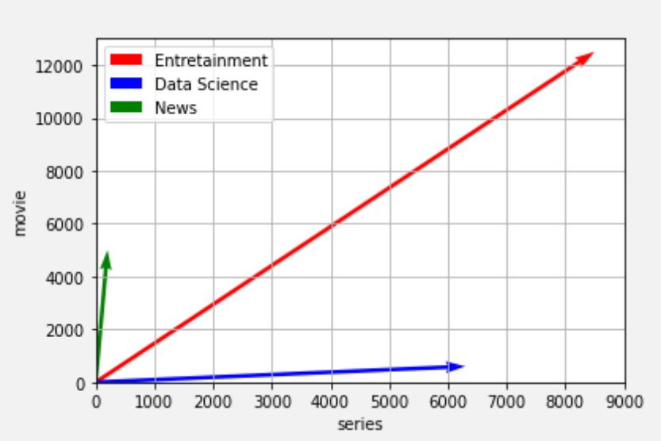
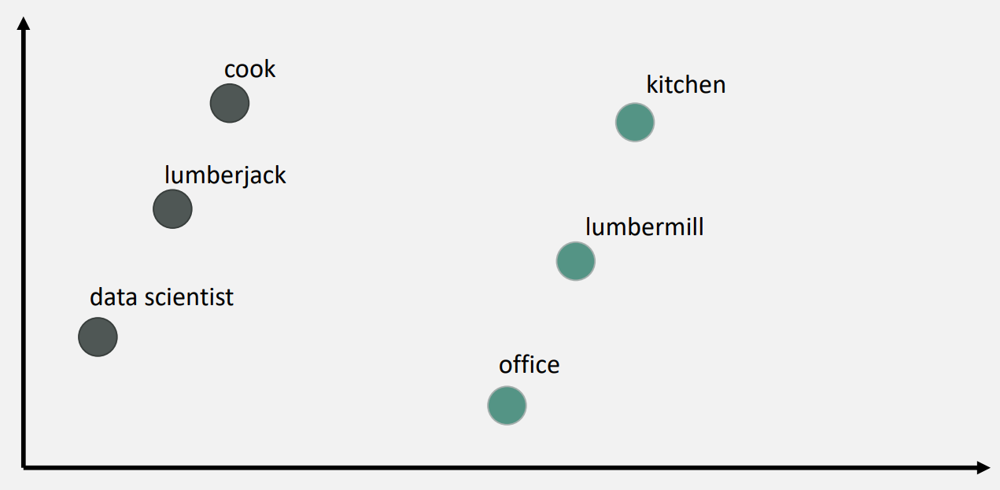
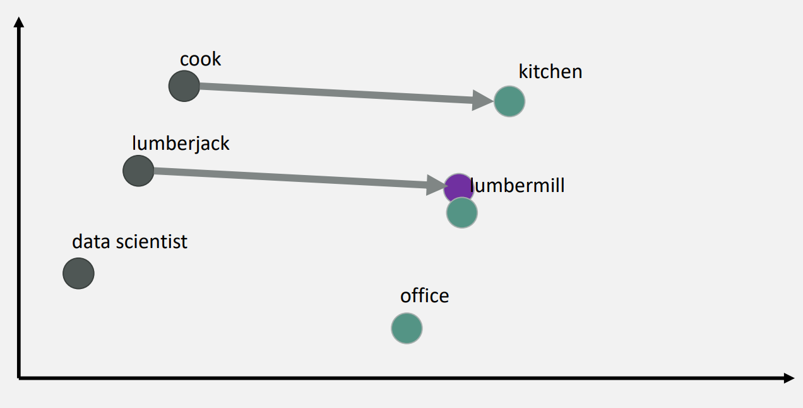
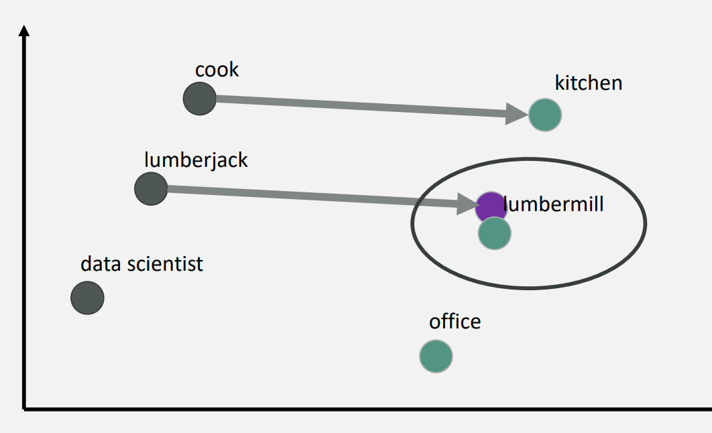
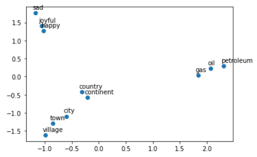

# NLP - Word Embeddings

# Recap - Practical Work #3


## Link to my jupyter notebook

[epf_nlp/words_embeddings.ipynb at main · GabrielTruong/epf_nlp](https://github.com/GabrielTruong/epf_nlp/blob/main/words_embeddings/words_embeddings.ipynb)

## Reminder of the lecture

Learning algorithms need to handle numeric values that is why we transform words into numbers. However, simple numbers don’t carry any intrinsic meaning. Hence, we can use vector spaces for different purposes such as:

- Extract meaning from words
- Calculate similarities between two different words

Example: “king” - “man” + “woman” = “queen”

- Define relations between words
- Machine Translation
- Chatbots

In summary, vector space models allow you to represent words and documents as vectors.

### Vector Spaces

Vector spaces represent the meaning of the words by analyzing the context around them in the text. To do that, we can either use a word by word design or a word by document design.

1. ************************************Word by word design************************************

This design relies on the number of times they co-occur in a distance k. 

Example: 

- I like action series.
- I prefer to watch animation action series.

|  | action | like | animation | watch | to | prefer | I |
| --- | --- | --- | --- | --- | --- | --- | --- |
| series | 2 | 1 | 1 | 0 | 0 | 0 | 0 |

With a word by word design, we can get a representation with n entries, with n between one and the size of your entire vocabulary. 

1. **********************************************Word by document design**********************************************

This design counts the number of times that words appeared in a document category.

For example,

1. We could have a corpus consisting of documents between different topics like food, italy, and nutrition.
2. We then count the number of times that the words appear on the document that belong to each of the three categories.

|  | Entertainment | Data Science | News |
| --- | --- | --- | --- |
| series | 8500 | 6300 | 200 |
| movie | 12500 | 600 | 5000 |
1. ******Vector Space******

Once we’ve constructed the representations for multiple sets of documents or words using either word by word or word by document design, we’ll get our vector space as follow: 



We can make comparisons between vector representations using the cosine similarity and the Euclidean distance in order to get the angle and distance between them. 

### Cosine Similarity

We will only cover the cosine similarity since the distance depends on the number of words in the corpus of the category.

For example, when comparing large documents to smaller ones with euclidean distance, one could get an inaccurate result.

To solve this problem, we look at the cosine between the vectors. The main advantage of the cosine similarity metric over the euclidean distance is that **it isn’t biased by the size difference between the representations.**

****************Formula:****************

$\vec{v}.\vec{w} = ||\vec{v}||.||\vec{w}||.cos(\beta)$ with $cos(\beta) = \frac{\vec{v}.\vec{w}}{||\vec{v}||.||\vec{w}||}$

******************Interpretation:******************

- The more similar two vectors are, the more closer to 1
- If two vectors are orthogonal, the cosine is 0

**To sum up:**

- The cosine similarity metric is proportional to the similarity between the directions of the vectors that you are comparing.
- The cosine similarity takes values between 0 and 1.

### How do we apply Vector Spaces ?

1. ****************************************Set the vector space****************************************



For this example, we are in a hypothetical two-dimensional vector space that has different representations for different jobs and its related “office”.

1. **************************Extract the difference from a known relation**************************


We extract the difference from the job “cook” and “kitchen”. Then we will use it for the other jobs. The other relations should be represented by the same distance vector between two related words. 

2. ********************************************Get the vector representation for the lumber jack********************************************



3. ********************************************************Find the most similar vector********************************************************



Once the vector representation is displayed, we can find the most similar vector. In our case, the most similar vector stands for “lumbermill”. 

### PCA & Visualization

In very high dimension (most cases), we can use Principal Component Analysis to reduce the dimensions to 2 or 3D so that we can visualize the data and the vector spaces. We won’t discuss in this report. 

---

## Practise Lab

### Objectives

We want to find the country of a city given the name of the name of the city. We will be using vector spaces to do so. Then we will evaluate and visualize our results with PCA.

### 1. Data processing

**Get the data**

```python
import pickle
import numpy as np
import pandas as pd
import matplotlib.pyplot as plt

from utils import get_vectors
data = pd.read_csv('capitals.txt', delimiter=' ')
data.columns = ['city1', 'country1', 'city2', 'country2']
```

We will use a file called `word_embeddings_capitals.p` that contains the pre-trained word embeddings of capital cities. This dataset comes originally from the google news word embedding dataset, which is about 3.64 gigabytes. We don't need all of those 3.64 gigas, se we are only using a small portion of that.

Now we will load the word embeddings as a [Python dictionary](https://docs.python.org/3/tutorial/datastructures.html#dictionaries). Remember, those word vectors have been learned using a machine learning algorithm from Google.

```python
word_embeddings = pickle.load(open("word_embeddings_subset.p", "rb"))
print(len(word_embeddings))
#-> 243
print("dimension: {}".format(word_embeddings['Spain'].shape[0]))
#-> 300
```

### 2. Predict relationship among words

Now we will write a function that will use the word embeddings to predict relationships among words.

- The function will take as input three words.
- The first two are related to each other.
- It will predict a 4th word which is related to the third word in a similar manner as the two first words are related to each other.
- As an example, "Athens is to Greece as Bangkok is to ______"?
- You will write a program that is capable of finding the fourth word.

To do this, compute we'll first compute cosine similarity metric.

```python
def cosine_similarity(A, B):
    '''
    Input:
        A: a numpy array which corresponds to a word vector
        B: A numpy array which corresponds to a word vector
    Output:
        cos: numerical number representing the cosine similarity between A and B.
    '''
    
    dot = np.dot(A,B)
    norma = np.linalg.norm(A)
    normb = np.linalg.norm(B)
    cos = dot/(norma*normb)

    return cos
```

```python
#Try with king & queen
king = word_embeddings['king']
queen = word_embeddings['queen']

cosine_similarity(king, queen) #-> 0.65
```

### 3. Finding the country of each capital

Now, we will use the previous functions to compute similarities between vectors, and use these to find the capital cities of countries. We will write a function that takes in three words, and the embeddings dictionary. 

```python
def get_country(city1, country1, city2, embeddings):
    """
    Input:
        city1: a string (the capital city of country1)
        country1: a string (the country of capital1)
        city2: a string (the capital city of country2)
        embeddings: a dictionary where the keys are words and values are their embeddings
    Output:
        countries: a dictionary with the most likely country and its similarity score
    """

    # store the city1, country 1, and city 2 in a set called group
    group = set([city1,country1,city2])

    # get embeddings 
    city1_emb = embeddings[city1]
    country1_emb = embeddings[country1]
    city2_emb = embeddings[city2]

    # get embedding of country 2 
		# (it's a combination of the embeddings of country 1, city 1 and city 2)
    # Remember: King - Man + Woman = Queen
    vec = country1_emb - city1_emb + city2_emb

    # Initialize the similarity to -1 
    similarity = -1 

    # initialize country to an empty string
    country = "" 

    # loop through all words in the embeddings dictionary
    for word in embeddings.keys():

        # first check that the word is not already in the 'group'
        if word not in group:

            # get the word embedding
            word_emb = embeddings[word]

            # calculate cosine similarity between embedding of country 2 
						#and the word in the embeddings dictionary
            cur_similarity = cosine_similarity(vec,word_emb) 

            if cur_similarity > similarity:
                similarity = cur_similarity

                # store the country as a tuple, which contains the word and the similarity
                country = (word,similarity)

    return country
```

### 4. Evaluate model with accuracy metric

will test your new function on the dataset and check the accuracy of the model: 

$accuracy = \frac{N Correct-pred.}{N Total-pred.}$

```python
def get_accuracy(word_embeddings, data):
    '''
    Input:
        word_embeddings: a dictionary where the key is a word and the value is its embedding
        data: a pandas dataframe containing all the country and capital city pairs
    
    Output:
        accuracy: the accuracy of the model
    '''
    num_correct = 0 
    for i, row in data.iterrows():

        # get cities & country
        city1 = row[0]
        country1 = row[1]
        city2 =  row[2]
        country2 = row[3]

        # use get_country to find the predicted country2
        predicted_country2, _ = get_country(city1, country1, city2, word_embeddings)

        if predicted_country2 == country2:
            num_correct += 1 

    m = len(data)
    accuracy = num_correct/m

    return accuracy
```

### 5. PCA for visualization

As explained earlier, PCA makes high dimension visualization possible. By reducing the dimension to 2 or 3D while keeping maximum information, we can visualize results thanks to Principal Components Analysis.

Let’s take several words and transform it into vectors. 

```python
words = ['oil', 'gas', 'happy', 'sad', 'city', 'town',
         'village', 'country', 'continent', 'petroleum', 'joyful']
X = get_vectors(word_embeddings, words)
print('You have 11 words each of 300 dimensions thus X.shape is:', X.shape)
# -> (11, 300)
```

However, it is difficult for us to visualize an object with a shape of (11,300) that is why we need PCA.

Before plotting the words, you need to first be able to reduce each word vector with PCA into 2 dimensions and then plot it. The steps to compute PCA are as follows:

1. Mean normalize the data
2. Compute the covariance matrix of your data (Σ).
3. Compute the eigenvectors and the eigenvalues of your covariance matrix
4. Multiply the first K eigenvectors by your normalized data.

The code for the PCA is available in the jupyter notebook. Now that we have implemented the PCA function, we will use it on our list of `words`.

```python
result = compute_pca(X, 2)
plt.scatter(result[:, 0], result[:, 1])
for i, word in enumerate(words):
    plt.annotate(word, xy=(result[i, 0] - 0.05, result[i, 1] + 0.1))

plt.show()
```



We can see that words with close meanings are close to each other. PCA seems to have kept enough information and help us visualize the vectors of word that we couldn’t visualize.